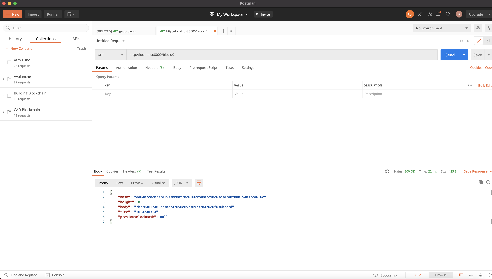
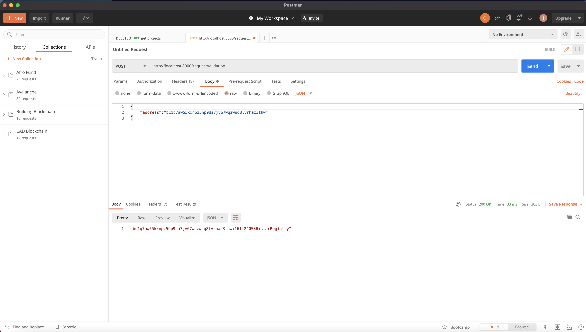
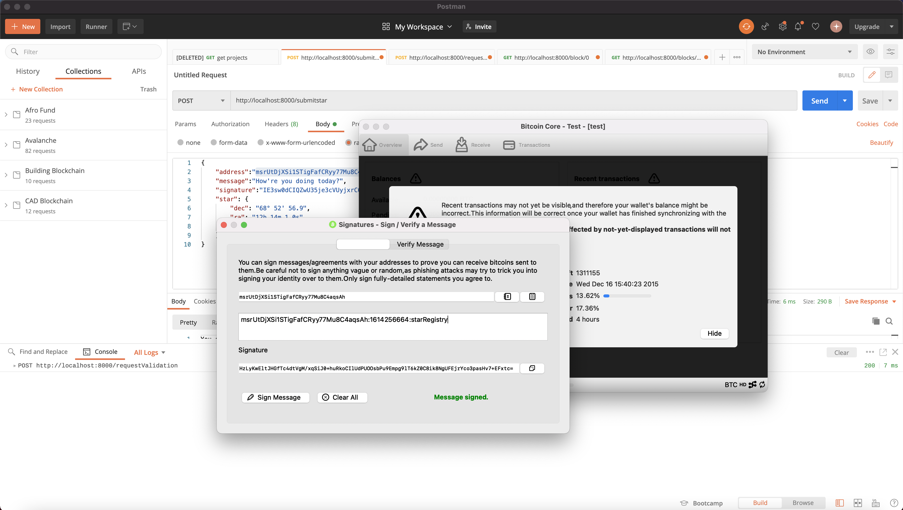
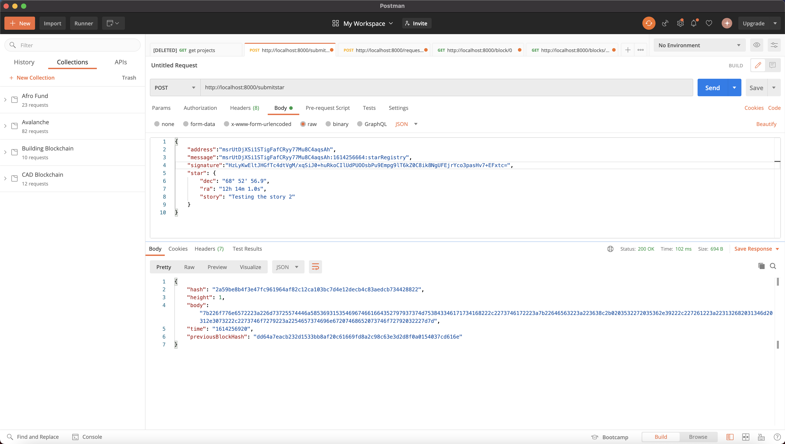
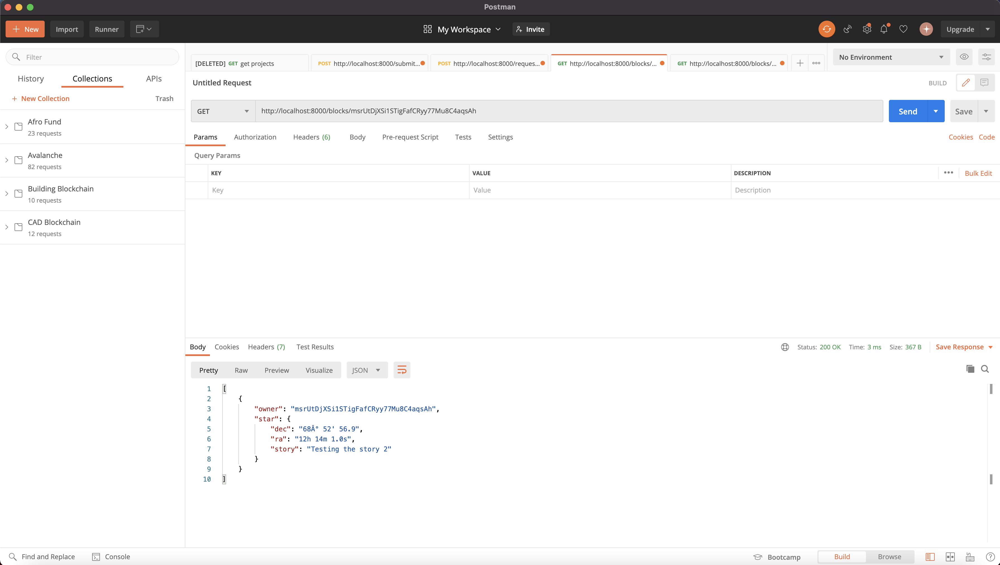

## Student Note
1. Some of the codes written in this project were gotten from https://github.com/udacity/nd1309_Project1_v2 and the project boilerplate given,
  
2. I was able to achieve the following after an extensive research. All codes written in this project were not midnlessly lifted.

3. Also, note the boilerplate codes also included guides in naming class, functions and objects. 

4. I have tested all endpoints and they work inline with the Project spcifications.

I have accepted the warning of palgarism and I have adjusted some of the functions cited from my source to suit my own original algorithm.
## These are screenshots taken from my laptop when running Bitocin Core on Testnet and POSTMAN?

1. Run the application using the command `node app.js`
You should see in your terminal a message indicating that the server is listening in port 8000:
> Server Listening for port: 8000

2. To make sure your application is working fine and it creates the Genesis Block you can use POSTMAN to request the Genesis block:
    
3. Make your first request of ownership sending your wallet address:
    
4. Signing the message with my Wallet:
    
5. Submiting my Star
     
6. Retrieving my Stars
    

    ALl my work on this project is reference to  https://github.com/udacity/nd1309_Project1_v2